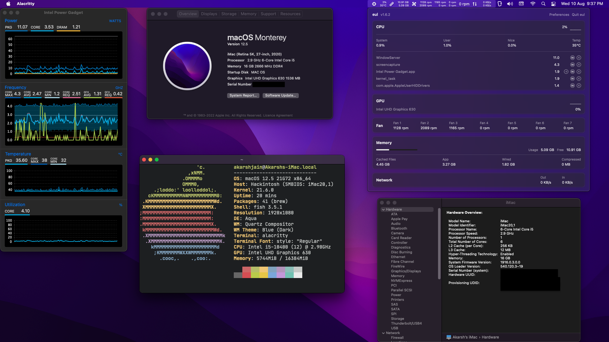
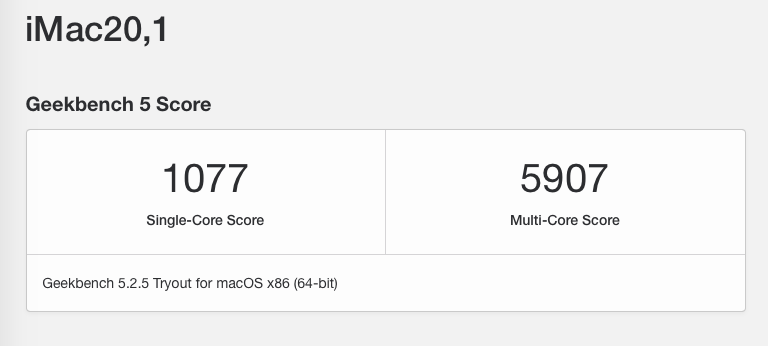
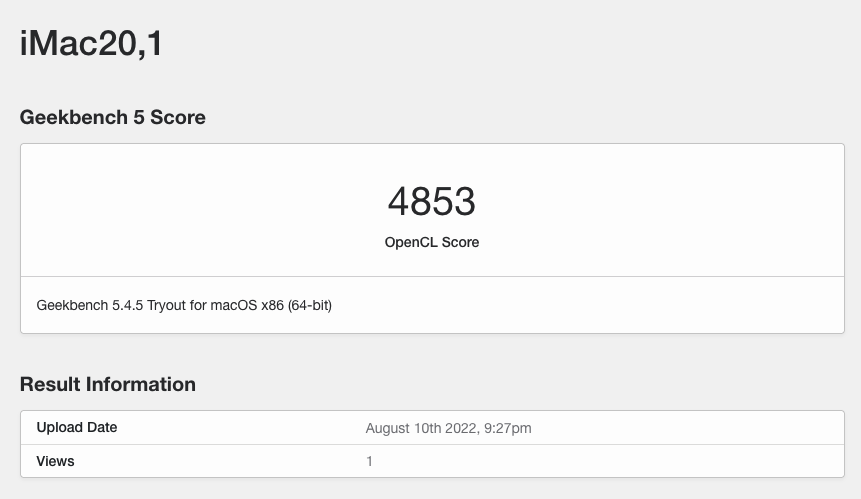
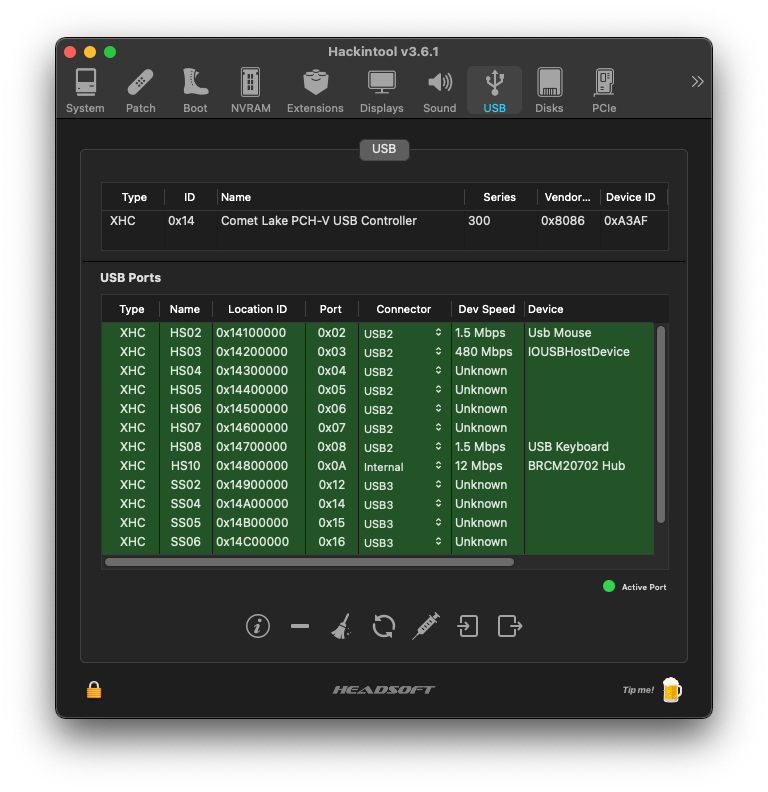

# ASUS TUF Gaming B460 Plus i5-10400 Opencore Hackintosh Build.






[BenchmarkCPU](https://browser.geekbench.com/v5/cpu/16550946)

---


[BenchmarkGPU](https://browser.geekbench.com/v5/compute/5282859)

---

## OpenCore Version: 0.8.3 (DEBUG) (Monterey supported)

## Guide Link: [Dortania's](https://dortania.github.io/OpenCore-Install-Guide/)


### Specifications 

| Part        | Specs                                       |
|-------------|---------------------------------------------|
| CPU         | Intel® Core™ i5-10400                       |
| iGPU        | Intel® UHD Graphics 630                     |
| dGPU        | NVIDIA 1650 Super (Disabled)                |
| Audio       | Realtek S1200A codec *layout-id: 1*         |
| Ethernet    | Intel® I219-V LAN                           |
| WiFi        | Fenvi-T919                                  |
| RAM         | HyperX FURY DDR4 HX432C16FB3/8 (X2)         |
| SSD         | Crucial P5 500GB 3D NAND NVMe CT500P5SSD8   |
| Motherboard | ASUS TUF Gaming B460 Plus BIOS Version 1401 |

### Working/Not working

| Works              | Feature                                               |
|--------------------|-------------------------------------------------------|
| :white_check_mark: | Siri, Appstore, Facetime                              |
| :white_check_mark: | All USB External Ports (3.0 + 2.0 ) including F-Panel |
| :white_check_mark: | Sound + Mic                                           |
| :white_check_mark: | HDMI (Audio + Graphics)                               |
| :x:                | DRM Content in Safari (Reason: IGPU only)             |
| :white_check_mark: | iGPU Stability                                        |
| :white_check_mark: | Sleep (also with peripherals plugged in)              |
| :white_check_mark: | Ethernet                                              |
| :white_check_mark: | Airplay                                               |
| :white_check_mark: | Wifi                                                  |
| :white_check_mark: | Bluetooth                                             |

> **DRM content Netflix/Prime/AppleTV+ cannot be played in Safari/AppleTV+** 
> **Plays well in Chrome/Firefox** 

### Installation Notes
- Before using the [BIOS](BIOS/HackintoshBuildOC_0_6_9.CMO) profile provided in this repo. :warning: :warning: Update the BIOS to the version 1401 :warning: :warning:. BIOS file: [Direct Download](https://dlcdnets.asus.com/pub/ASUS/mb/LGA1200/TUF_GAMING_B460-PLUS/TUF-GAMING-B460-PLUS-ASUS-1401.zip). If you've Windows 10 installed I recommend you use [Asus AI Suite](https://dlcdnets.asus.com/pub/ASUS/mb/LGA1200/TUF_GAMING_B460-PLUS/ASUS_AI_Suite_3_V3.00.59_WIN10_64-bit.zip) and update BIOS using this utility. Universal update instructions can be found on [BIOS EZ flash utility](https://www.asus.com/in/support/FAQ/1008859/).  

- Rename [`sample_config.plist`](OC/sample_config.plist) to `config.plist`

- Replace the SMBIOS Information by generating a new one [Refer iMac20,1](https://dortania.github.io/OpenCore-Install-Guide/config.plist/comet-lake.html#platforminfo). If you're upgrading the OS you just need to make replacements with your current `config.plist` values. 
  - Replace  [`{replace with Board Serial}`](OC/sample_config.plist#L1023) with generated **Board Serial**. 
  - Replace  [`{replace with Serial}`](OC/sample_config.plist#L1035) with generated **Serial**. 
  - Replace  [`{replace with SmUUID}`](OC/sample_config.plist#L1037) with generated **SmUUID**.  

- Follow the Dortania's installation Guide to [prepare usb stick](https://dortania.github.io/OpenCore-Install-Guide/installer-guide/#creating-the-usb) and then the [installation process](https://dortania.github.io/OpenCore-Install-Guide/installation/installation-process.html#installation-process).

### Benchmarks:
- [CPU GeekBench](https://browser.geekbench.com/v5/cpu/4534195)
- [GPU GeekBench](https://browser.geekbench.com/v5/compute/1771511)

### What not goes along with the Dortania's Guide.
- `SSDT-RHUB.aml` after tinkerning a lot realized that it is not required.
- `XHCI-unsupported.kext` needed to be added (probably B460 chipset issue).
- `DeviceProperties -> PciRoot(0x0)/Pci(0x2,0x0) - device-id = 923E0000 alongwith framebuffer patching. 
  *Stumbled this error when app:* 
  - Alacritty: Thrown ```Assertion failed: (0), function CreateCompiler, file /Library/Caches/com.apple.xbs/Sources/GPUDriversIntel/GPUDriversIntel-14.7.8/GLRenderer/kbl/usc_interface.cpp, line 1676.``` 
  - Safari: Pages were crashing. 

### Interesting discovery while resolving USB3.0 issue:

- USB3.0 issue fix
  - While remapping the USB ports I realized that the `USBInjectAll.kext/Contents/Info.plist` does not have the correct usb controller device id thanks to  [u/Dradis101](https://www.reddit.com/user/Dradis101) needed to rename `A2AF` to `A3AF` then the mapping process. (Find link in reference)
  - Then I performed the mapping using [:white_check_mark: hackintool](https://github.com/headkaze/Hackintool/releases/). I could've done manual mapping as well using this guide [:white_check_mark: manual mapping](https://dortania.github.io/OpenCore-Post-Install/usb/manual/manual.html#usb-mapping)
  - **WARNING:** USB2 and USB3 are mapped separately always !! **Never ever dare to think that the USB Type 3 port would automatically handle USB Type 2 device.** This is because when the USB2 and USB3 type devices  inserted in the same port maps to different port location in the system. See the mapping in the screenshot. 
  - **NOTE:** [:x: Intel auto mapping does not work](https://dortania.github.io/OpenCore-Post-Install/usb/intel-mapping/intel.html#usb-mapping)


### References: 
  - [Intel® UHD Graphics 630 fix](https://www.reddit.com/r/hackintosh/comments/gx4oyk/uhd_630_graphics_fix_for_open_core/)
  - [USB 3 fix](https://www.reddit.com/r/hackintosh/comments/id1lm9/please_help_me_get_these_usb_3_ports_working/?utm_source=share&utm_medium=ios_app&utm_name=iossmf)
  - Thanks to [dovtuan](https://github.com/dovtuan/Gigabyte-B460M-Aorus-Pro-Hackintosh-Open-Core) for maintaining the OC configuration for Gigabyte-B460M-Aorus-Pro
 
